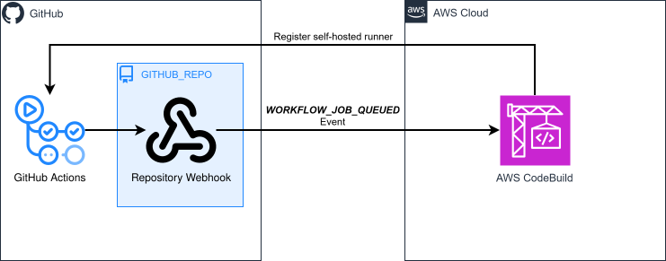

# cdk-codebuild-gha-runners

CDK app that, given an existing GitHub repository, attaches a repository webhook that triggers [CodeBuild-hosted GitHub Actions runners](https://docs.aws.amazon.com/codebuild/latest/userguide/action-runner.html) when workflow jobs are queued.

### Related Apps

- [cdktn/codebuild-gha-runners](../../cdktn/codebuild-gha-runners) - Built with CDKTN instead of AWS CDK.
- [cdktn/codebuild-gha-runners-org](../../cdktn/codebuild-gha-runners-org) - Built with CDKTN instead of AWS CDK; uses a GitHub organization webhook instead of repository webhook.

## Prerequisites

- **_AWS:_**
  - Must have authenticated with [Default Credentials](https://docs.aws.amazon.com/cdk/v2/guide/cli.html#cli_auth) in your local environment.
  - Must have completed the [CDK bootstrapping](https://docs.aws.amazon.com/cdk/v2/guide/bootstrapping.html) for the target AWS environment.
- **_GitHub:_**
  - Must have created a GitHub repository in your personal account.
  - Must have set the `GITHUB_TOKEN`, `GITHUB_OWNER` and `GITHUB_REPO` variables in your local environment.
- **_mise:_**
  - [Install mise](https://mise.jdx.dev/installing-mise.html), which manages the required toolchain.

## Installation

```sh
mise install
pnpm install
```

## Deployment

```sh
pnpm run deploy
```

## Usage

1. Grab the `<GHA_RUNNER_LABEL>` from the deployment outputs:

   ```sh
   Outputs:
   GhaRunnerLabel = <GHA_RUNNER_LABEL>
   ```

2. Create a new GitHub Actions workflow and specify the runner:

   ```yaml
   runs-on: <GHA_RUNNER_LABEL>
   ```

3. Commit and push your workflow file to the repository.

4. Your workflow will be enqueued and run on an ephemeral EC2 instance managed by AWS CodeBuild.

## Cleanup

```sh
pnpm destroy
```

## Architecture Diagram


