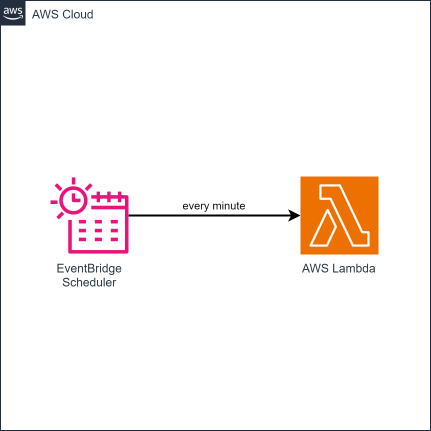

# cdk-cron-function

CDK app that triggers a Lambda function at a specified regular interval.

## Prerequisites

- **_AWS:_**
  - Must have completed the [CDK bootstrapping](https://docs.aws.amazon.com/cdk/v2/guide/bootstrapping.html) for the target AWS environment.
- **_mise:_**
  - [Install mise](https://mise.jdx.dev/installing-mise.html), which manages the required toolchain.

## Installation

```sh
mise install
pnpm install
```

## Deployment

```sh
pnpm run deploy
```

## Cleanup

```sh
pnpm destroy
```

## Architecture Diagram


