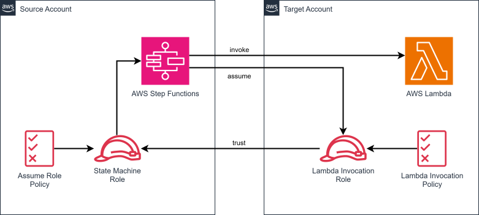

# cdk-cross-account-lambda

CDK app that deploys a Lambda function that gets invoked by a Step Functions state machine in another AWS account. The repository is intended to demonstrate [cross‑account access for AWS Step Functions](https://aws.amazon.com/about-aws/whats-new/2022/11/simplify-cross-account-access-aws-services-step-functions/).

## Prerequisites

- **_AWS:_**
  - Must have completed the steps detailed in the [Configuration](#configuration) section.
- **_mise:_**
  - [Install mise](https://mise.jdx.dev/installing-mise.html), which manages the required toolchain.

## Configuration

Set the following variables in your local environment:

- `CDK_ACCOUNT_SRC` - The AWS account ID for the source stack (e.g. `123456789012`)
- `CDK_REGION_SRC` - The AWS region for the source stack (e.g. `us-east-1`)
- `CDK_ACCOUNT_TRG` - The AWS account ID for the target stack (e.g. `123456789012`)
- `CDK_REGION_TRG` - The AWS region for the target stack (e.g. `us-east-1`)

After that, complete the [CDK bootstrapping](https://docs.aws.amazon.com/cdk/v2/guide/bootstrapping.html) process for both the `SRC` and `TRG` accounts.

1. Execute the command below with a user having admin privileges in the `SRC` account:

   ```sh
   cdk bootstrap aws://$CDK_ACCOUNT_SRC/$CDK_REGION_SRC
   ```

2. Execute the command below with a user having admin privileges in the `TRG` account:

   ```sh
   cdk bootstrap aws://$CDK_ACCOUNT_TRG/$CDK_REGION_TRG --trust $CDK_ACCOUNT_SRC --cloudformation-execution-policies arn:aws:iam::aws:policy/AdministratorAccess
   ```

## Installation

```sh
mise install
pnpm install
```

## Deployment

Execute the command below as admin of the `SRC` account:

```sh
pnpm run deploy --all --require-approval never
```

## Cleanup

Execute the command below as admin of the `SRC` account:

```sh
pnpm destroy --all --force
```

## Architecture Diagram


