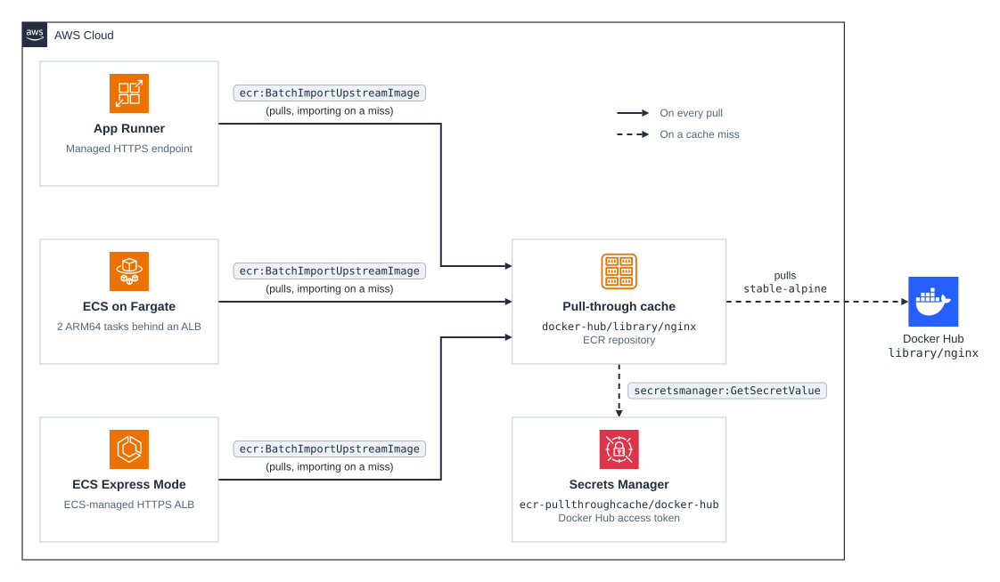

# cdk-ecr-dockerhub-pull-through-cache

CDK app that caches the NGINX image from Docker Hub in Amazon ECR with a [pull-through cache rule](https://docs.aws.amazon.com/AmazonECR/latest/userguide/pull-through-cache.html), then runs it on three AWS container services side by side.

| Stack                                                  | Runs                                                                                                             | Endpoint                        |
| ------------------------------------------------------ | ---------------------------------------------------------------------------------------------------------------- | ------------------------------- |
| `cdk-ecr-dockerhub-pull-through-cache-dev`             | ECR pull-through cache rule for Docker Hub and the `docker-hub/library/nginx` cache repository                   | —                               |
| `cdk-ecr-dockerhub-pull-through-cache-apprunner-dev`   | [AWS App Runner](https://docs.aws.amazon.com/apprunner/latest/dg/what-is-apprunner.html)                         | HTTPS on the App Runner domain  |
| `cdk-ecr-dockerhub-pull-through-cache-ecs-fargate-dev` | Amazon ECS on Fargate behind an Application Load Balancer that the stack manages                                 | HTTP on the load balancer       |
| `cdk-ecr-dockerhub-pull-through-cache-ecs-express-dev` | [Amazon ECS Express Mode](https://docs.aws.amazon.com/AmazonECS/latest/developerguide/express-service-work.html) | HTTPS on the ECS-managed domain |

The pull-through cache rule exists once per registry, so all three services share the cache stack, and deploying any of them deploys it first. Each service role gets `ecr:BatchImportUpstreamImage` on the cache repository directly, rather than through the registry permissions policy, which is a single document per registry and would replace any policy already there.

Docker Hub is contacted only on the first pull of a tag and when ECR revalidates it, at most once every 24 hours. Every other pull is served from ECR in the same Region.

> [!IMPORTANT]
> App Runner is [closed to new customers](https://docs.aws.amazon.com/apprunner/latest/dg/apprunner-availability-change.html). The App Runner stack deploys only in accounts that already use App Runner. AWS recommends ECS Express Mode as its replacement.

## Prerequisites

- **_AWS:_**
  - Must have authenticated with [Default Credentials](https://docs.aws.amazon.com/cdk/v2/guide/cli.html#cli_auth) in your local environment.
  - Must have completed the [CDK bootstrapping](https://docs.aws.amazon.com/cdk/v2/guide/bootstrapping.html) for the target AWS environment.
  - The target Region must have a default VPC with public subnets in at least two Availability Zones, which both ECS stacks use.
- **_Docker Hub:_**
  - Must have stored your Docker Hub username and [access token](https://docs.docker.com/security/access-tokens/) in AWS Secrets Manager as a secret named `ecr-pullthroughcache/docker-hub`, in the Region you deploy to, so the token never appears in the CloudFormation template. A token with read-only access to public repositories is enough.

    ```sh
    aws secretsmanager create-secret --name ecr-pullthroughcache/docker-hub \
      --secret-string "{\"username\":\"$DOCKERHUB_USERNAME\",\"accessToken\":\"$DOCKERHUB_ACCESS_TOKEN\"}"
    ```

- **_mise:_**
  - [Install mise](https://mise.jdx.dev/installing-mise.html), which manages the required toolchain.

## Installation

```sh
mise install
pnpm install
```

## Deployment

Deploy every stack:

```sh
pnpm run deploy --all
```

Or deploy one service, which also deploys the cache stack:

```sh
pnpm run deploy cdk-ecr-dockerhub-pull-through-cache-ecs-express-dev
```

Each service stack prints the URL of its NGINX service as an output.

## Cleanup

```sh
pnpm destroy --all
```

The Docker Hub secret is not managed by the stacks, so delete it separately:

```sh
aws secretsmanager delete-secret --secret-id ecr-pullthroughcache/docker-hub --force-delete-without-recovery
```

ECS Express Mode creates the `default` ECS cluster if it does not already exist, and it is kept after the stack is deleted.

## Architecture Diagram - High Level



## Architecture Diagram - Low Level


1. **Pulling the tag**
   - A service pulls `stable-alpine` from `<account>.dkr.ecr.<region>.amazonaws.com/docker-hub/library/nginx`. The `docker-hub` prefix matches the pull-through cache rule, which maps the rest of the path to `registry-1.docker.io/library/nginx`. Besides the usual pull actions, the service's role needs `ecr:BatchImportUpstreamImage`, which lets the pull fill the cache.

2. **Reading the Docker Hub token**
   - On a cache miss, which is the first pull of the tag or a pull more than 24 hours after ECR last checked it against Docker Hub, ECR's service-linked role `AWSServiceRoleForECRPullThroughCache` reads the token from the `ecr-pullthroughcache/docker-hub` secret.

3. **Pulling from Docker Hub**
   - ECR pulls `library/nginx:stable-alpine` from Docker Hub with that token: the image index and every manifest it references, which are 8 platform images and 8 attestation manifests. If Docker Hub cannot be reached, ECR serves the copy it already has.

4. **Caching the image**
   - ECR stores the index and its manifests in `docker-hub/library/nginx`. Only the index carries the tag; the manifests stay untagged and are kept for as long as an index references them.

5. **Reading the platform manifest**
   - Each service reads the manifest for its own platform from the index: App Runner and ECS Express Mode run `linux/amd64`, and ECS on Fargate runs `linux/arm64`. The other platforms' manifests stay cached but unused.
