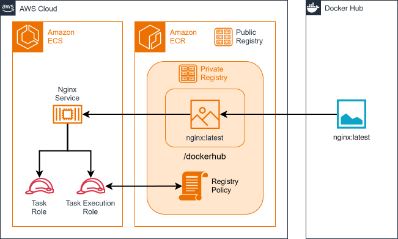

# cdk-ecs-dockerhub-cache

CDK app that deploys the NGINX image from Docker Hub to Amazon ECS using ECR pull-through cache.

### Related Apps

- [cdk/apprunner-dockerhub-cache](../../cdk/apprunner-dockerhub-cache) - Uses App Runner instead of ECS.

## Prerequisites

- **_AWS:_**
  - Must have authenticated with [Default Credentials](https://docs.aws.amazon.com/cdk/v2/guide/cli.html#cli_auth) in your local environment.
  - Must have completed the [CDK bootstrapping](https://docs.aws.amazon.com/cdk/v2/guide/bootstrapping.html) for the target AWS environment.
- **_Docker Hub:_**
  - Must have set the `DOCKERHUB_USERNAME` and `DOCKERHUB_ACCESS_TOKEN` variables in your local environment.
- **_mise:_**
  - [Install mise](https://mise.jdx.dev/installing-mise.html), which manages the required toolchain.

## Installation

```sh
mise install
pnpm install
```

## Deployment

```sh
pnpm run deploy
```

## Cleanup

```sh
pnpm destroy
```

## Architecture Diagram


