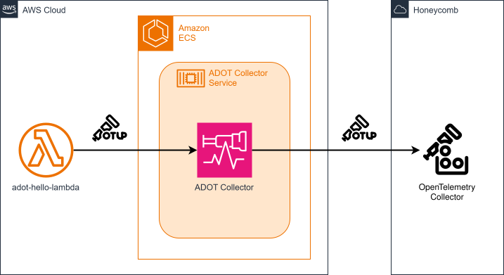

# cdk-ecs-otel-collector

CDK app that deploys an OpenTelemetry collector to Amazon ECS with a Lambda function that sends trace data to Honeycomb via the gateway collector.

### Related Apps

- [cdk/apprunner-otel-collector](../../cdk/apprunner-otel-collector) - Uses App Runner instead of ECS.

## Prerequisites

- **_AWS:_**
  - Must have authenticated with [Default Credentials](https://docs.aws.amazon.com/cdk/v2/guide/cli.html#cli_auth) in your local environment.
  - Must have completed the [CDK bootstrapping](https://docs.aws.amazon.com/cdk/v2/guide/bootstrapping.html) for the target AWS environment.
- **_Honeycomb:_**
  - Must have set the `HONEYCOMB_API_KEY` variable in your local environment.
- **_mise:_**
  - [Install mise](https://mise.jdx.dev/installing-mise.html), which manages the required toolchain.

## Installation

```sh
mise install
pnpm install
```

## Deployment

```sh
pnpm run deploy
```

## Cleanup

```sh
pnpm destroy
```

## Architecture Diagram


