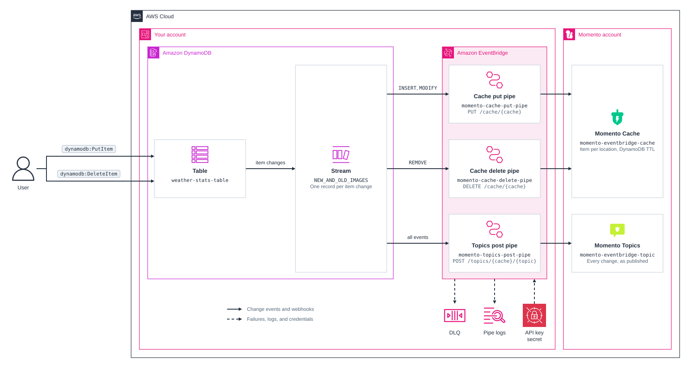

# cdk-eventbridge-webhooks-momento

CDK app that demonstrates how to use Amazon EventBridge to send webhook events to Momento.

## Prerequisites

- **_AWS:_**
  - Must have authenticated with [Default Credentials](https://docs.aws.amazon.com/cdk/v2/guide/cli.html#cli_auth) in your local environment.
  - Must have completed the [CDK bootstrapping](https://docs.aws.amazon.com/cdk/v2/guide/bootstrapping.html) for the target AWS environment.
- **_Momento:_**
  - Must have set the `MOMENTO_API_KEY` and `MOMENTO_API_ENDPOINT` variables in your local environment.
  - Must have created a cache named `momento-eventbridge-cache` in your Momento account.
- **_mise:_**
  - [Install mise](https://mise.jdx.dev/installing-mise.html), which manages the required toolchain.

## Installation

```sh
mise install
pnpm install
```

## Deployment

```sh
pnpm run deploy
```

## Usage

### CLI App

```sh
pnpm -C src/demo/cli start
```

### Web App

```sh
pnpm -C src/demo/web dev
```

## Cleanup

```sh
pnpm destroy
```

## Architecture Diagram


