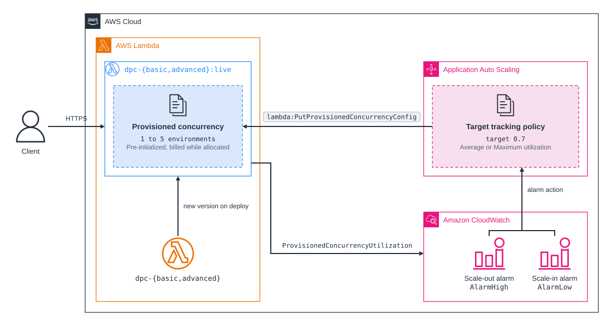

# cdk-lambda-dynamic-provisioned-concurrency

CDK app that deploys a Lambda function with provisioned concurrency managed by Application Auto Scaling, twice, so you can compare the CDK default scaling policy with one tuned for bursty and idle traffic.

## How it works

Provisioned concurrency keeps a number of execution environments initialized ahead of time, so requests served by them never pay a cold start. It is configured on an alias or version, never on `$LATEST`, and you pay for it while it is allocated, whether or not it serves traffic.

Each stack registers the `live` alias as an Application Auto Scaling scalable target with a capacity of 1 to 5 and adds a target tracking policy that keeps `ProvisionedConcurrencyUtilization` near 0.7. Application Auto Scaling creates two CloudWatch alarms for the policy:

- `AlarmHigh` fires after 3 consecutive one-minute datapoints above 0.7 and raises capacity to `current × utilization / 0.7`, rounded up.
- `AlarmLow` fires after 15 consecutive one-minute datapoints below 0.63 and lowers capacity one step at a time.

Utilization cannot exceed 1.0, so one scale-out step grows capacity by at most a factor of 1 / 0.7, about 1.43: from 1 to 2, from 3 to 5. A sudden jump in traffic takes several steps of a few minutes each to absorb, and the requests above the provisioned capacity spill over to on-demand environments in the meantime, with cold starts.

Registering the target with `minCapacity: 1` allocates the first environment, so the alias needs no `provisionedConcurrentExecutions` of its own. CloudFormation finishes before that environment is `READY`, so the first requests after a deployment can still run on demand. Provisioned concurrency belongs to the alias, so a deployment that publishes a new version moves the current capacity to it: after a redeploy, both aliases came back with the 3 and 5 environments they had before.

## The two stacks

| Stack | Function | Policy metric | Statistic | When the function is idle |
| --- | --- | --- | --- | --- |
| `cdk-lambda-dpc-basic-dev` | `dpc-basic` | Predefined `LambdaProvisionedConcurrencyUtilization` | Average | No datapoints, neither alarm can fire, capacity stays where it is |
| `cdk-lambda-dpc-advanced-dev` | `dpc-advanced` | Metric math `FILL(utilization, 0)` | Maximum | Gaps count as 0, `AlarmLow` fires, capacity returns to the minimum |

The basic stack is what `alias.addAutoScaling()` and `scaleOnUtilization()` produce in CDK. It has two weaknesses, both mentioned in the [Lambda provisioned concurrency documentation](https://docs.aws.amazon.com/lambda/latest/dg/provisioned-concurrency.html):

- Lambda publishes one `ProvisionedConcurrencyUtilization` sample per invocation of the alias, valued at the share of provisioned environments busy at that moment. The predefined metric averages those samples over each minute. Steady background traffic contributes many samples at low utilization, so bursts on top of it can saturate the provisioned capacity, and spill over, while the minute's average stays below the target. The Maximum statistic reacts to the busiest moment of the minute instead.
- Lambda emits no samples while the alias receives no requests. When traffic stops, the alarms have no datapoints to evaluate, Application Auto Scaling has nothing to act on, and the alias keeps, and bills for, whatever capacity it reached at the last peak.

The advanced stack fixes both with a target tracking policy on a metric math expression. CDK's `ScalableTarget.scaleToTrackMetric()` accepts one metric only, so the policy is a `CfnScalingPolicy`:

```ts
customizedMetricSpecification: {
  metrics: [
    { id: "utilization", metricStat: { metric: /* ProvisionedConcurrencyUtilization */, stat: "Maximum" }, returnData: false },
    { id: "utilizationOrZero", expression: "FILL(utilization, 0)", returnData: true },
  ],
},
```

## Results

Measured on 2026-10-10 in `eu-central-1` with `aws-cdk-lib` 2.272.0, `nodejs24.x` on arm64, and 1024 MB, by loading both Function URLs at the same time with oha:

| Phase | Load | `dpc-basic` (Average) | `dpc-advanced` (Maximum, idle as 0) |
| --- | --- | --- | --- |
| Sustained | 4 connections, 200 ms requests, 8 minutes, starting at 1 environment | 1 → 2 → 3 in about 6 minutes, then 5 a minute after the load stopped | 1 → 2 → 3 in about 6 minutes |
| Idle | No requests | Stayed at 5 for the 14 minutes until it was reset by hand | 3 → 2 → 1, starting 15 minutes after the last request |
| Steady plus bursts | 1 connection throughout, plus 6 connections for 10 s every minute, 500 ms requests, 8 minutes, starting at 3 environments | Stayed at 3: the per-minute average was 0.68 to 0.69 | 3 → 5 after 3 minutes: the per-minute maximum was 1.0 |

Under sustained load both statistics read 1.0 and the policies behave alike; about 70% of the requests spilled over to on-demand environments while capacity caught up. With steady traffic plus bursts, the average sat just under the 0.7 target, so `dpc-basic` never scaled out and a third of its requests spilled over for the whole run. Once `dpc-advanced` reached 5 environments, its spillover halved, from 136 to 68 requests per two minutes. Only 4 of the spilled requests per function were cold starts, because the on-demand environments they created stayed warm between bursts.

For the idle phase, the basic alias's `AlarmHigh` went to `INSUFFICIENT_DATA` and its `AlarmLow` never left `OK`, so 5 environments stayed provisioned with nothing to serve. The Function URLs were the only traffic, and the targets were briefly re-registered between phases to give both aliases the same starting capacity.

## Function

The handler uses the [Powertools for AWS Lambda (TypeScript)](https://docs.powertools.aws.dev/lambda/typescript/latest/) HTTP event handler to route the Function URL request and Logger for structured logs. It accepts `?delay=<ms>`, capped at 1000, to simulate work: a request that stays in flight longer raises concurrency, which is what a load test needs to move the utilization metric.

Every log line carries `initialization_type`, which Lambda sets per execution environment to `provisioned-concurrency` or `on-demand`. Powertools reports `cold_start: true` only for on-demand environments, so a cold start in these logs is a request that spilled over the provisioned capacity.

## Prerequisites

- **_AWS:_**
  - Must have authenticated with [Default Credentials](https://docs.aws.amazon.com/cdk/v2/guide/cli.html#cli_auth) in your local environment.
  - Must have completed the [CDK bootstrapping](https://docs.aws.amazon.com/cdk/v2/guide/bootstrapping.html) for the target AWS environment.
- **_mise:_**
  - [Install mise](https://mise.jdx.dev/installing-mise.html), which manages the required toolchain.

## Installation

```sh
mise install
pnpm install
```

## Deployment

```sh
pnpm run deploy
```

Both stacks deploy and each keeps at least one 1024 MB environment provisioned until you destroy it. The Function URLs use `NONE` auth, so anyone with a URL can invoke the function.

## Usage

1. Grab the Function URLs from the deployment outputs:

   ```sh
   Outputs:
   cdk-lambda-dpc-basic-dev.ScalableFunctionUrl = <BASIC_FUNCTION_URL>
   cdk-lambda-dpc-advanced-dev.ScalableFunctionUrl = <ADVANCED_FUNCTION_URL>
   ```

2. Put both functions under the same load with [oha](https://github.com/hatoo/oha), for example 4 concurrent connections whose requests take 200 ms each:

   ```sh
   oha -c 4 -z 8m "<BASIC_FUNCTION_URL>?delay=200"
   oha -c 4 -z 8m "<ADVANCED_FUNCTION_URL>?delay=200"
   ```

3. Watch the requested and allocated provisioned concurrency of each alias:

   ```sh
   aws lambda get-provisioned-concurrency-config --function-name dpc-advanced --qualifier live
   ```

4. Read why Application Auto Scaling changed it:

   ```sh
   aws application-autoscaling describe-scaling-activities --service-namespace lambda \
     --resource-id function:dpc-advanced:live \
     --query 'ScalingActivities[].[StartTime,StatusCode,Description,Cause]' --output text
   ```

5. Count the requests that spilled over to on-demand environments in CloudWatch Logs Insights on `/aws/lambda/dpc-advanced`:

   ```sql
   filter message = "Request served"
   | stats count(*) as requests by initialization_type, bin(1m)
   ```

## Cleanup

```sh
pnpm run destroy
```

Lambda creates the functions' log groups outside the stacks, so `/aws/lambda/dpc-basic` and `/aws/lambda/dpc-advanced` remain until you delete them.

## Architecture Diagram


