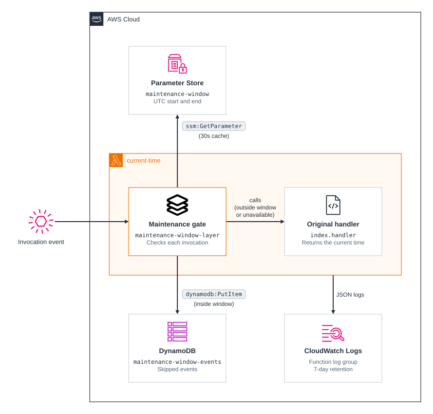
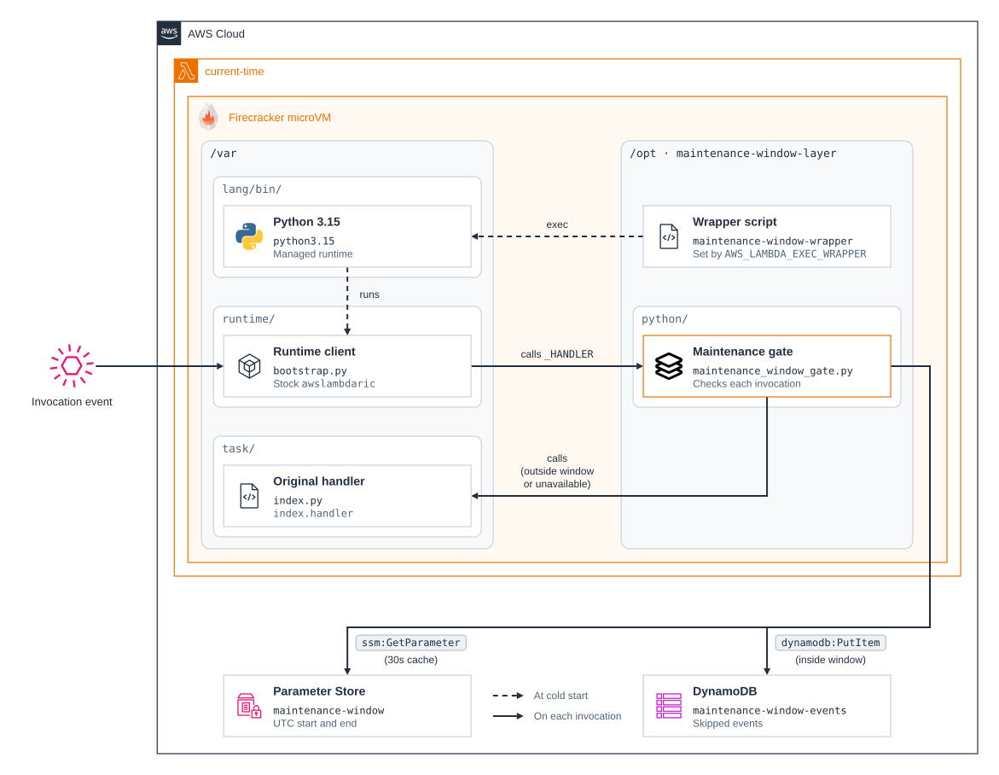

# cdk-lambda-internal-extension

CDK app that deploys a Lambda internal extension to modify the standard behaviour of AWS Lambda.

The `current-time` function runs on the `python3.15` [preview runtime](https://aws.amazon.com/blogs/compute/introducing-public-preview-runtimes-on-aws-lambda-starting-with-node-js-26-and-python-3-15/), which is not covered by the Lambda SLA and should not be used for production workloads.

## Prerequisites

- **_AWS:_**
  - Must have authenticated with [Default Credentials](https://docs.aws.amazon.com/cdk/v2/guide/cli.html#cli-auth) in your local environment.
  - Must have completed the [CDK bootstrapping](https://docs.aws.amazon.com/cdk/v2/guide/bootstrapping.html) for the target AWS environment.
- **_mise:_**
  - [Install mise](https://mise.jdx.dev/installing-mise.html), which manages the required toolchain.

## Installation

```sh
mise install
pnpm install
```

## Deployment

```sh
pnpm run deploy
```

Every deployment writes the `maintenance-window` parameter, replacing any value set in Parameter Store since the last one. By default the window runs from today 00:00 UTC to tomorrow 00:00 UTC, so maintenance is active right after each deployment, which is intended for the demo. To choose the window instead, pass ISO 8601 datetimes with UTC offsets:

```sh
pnpm run deploy -c maintenanceWindow=2026-10-01T02:00:00Z,2026-10-01T04:00:00Z
```

## Testing

```sh
pnpm check
```

This lints, typechecks, and synthesizes the app, tests the synth-time window validation with the Node.js test runner, and runs the maintenance-window gate's regression tests on Python 3.15 through `uv`, with AWS calls stubbed.

## Cleanup

```sh
pnpm destroy
```

## Architecture Diagram - High Level



1. **Lambda Layer Creation**
   - A Lambda layer containing the internal extension is created and attached to the Lambda function.

2. **Triggering the Lambda Function**
   - The Lambda function can be triggered manually by the user or programmatically via a cron job using Amazon EventBridge.

3. **Executing the Wrapper Script**
   - Upon startup, the Lambda function is configured to execute a [wrapper script](https://docs.aws.amazon.com/lambda/latest/dg/runtimes-modify.html#runtime-wrapper) from the Lambda layer. This execution is specified by the `AWS_LAMBDA_EXEC_WRAPPER` environment variable, which points to the path of the wrapper script.

4. **Swapping the Handler**
   - The wrapper script stores the configured handler in `MAINTENANCE_WINDOW_ORIGINAL_HANDLER`, points `_HANDLER` at the layer's `maintenance_window_gate.handler`, and then starts the managed runtime unchanged. The stock [awslambdaric](https://github.com/aws/aws-lambda-python-runtime-interface-client) (AWS Lambda Runtime Interface Client) therefore loads the gate, which reads the `maintenance-window` parameter from Parameter Store. Each execution environment caches the window for 30 seconds, because Parameter Store allows 40 `GetParameter` calls per second per account and Region by default, so parameter edits take up to 30 seconds to apply. The current time is still checked on every invocation. Caching reduces throttling but does not remove it: each new execution environment reads the parameter on its first invocation, so a burst of cold starts can still exceed the quota, and a throttled read fails open until the next refresh. Enable [higher throughput](https://docs.aws.amazon.com/systems-manager/latest/userguide/parameter-store-throughput.html) for functions that scale out quickly.

5. **Checking the Maintenance Window**
   - The gate checks whether the current datetime falls within the defined maintenance window, from its start (inclusive) to its end (exclusive):
     - If it falls within the window, the Lambda function handler is bypassed. Instead, the Lambda invocation event is stored in Amazon DynamoDB for future manual triggering, and the invocation returns a `{"skipped": true, ...}` result. Returning a result rather than an error stops Lambda from retrying asynchronous events, so the DynamoDB archive is the only copy to replay. If the archive write fails, the invocation errors and the event falls back to Lambda's normal retries.
     - If it falls outside the window, the gate calls the configured handler, so the Lambda function operates as usual.
     - If the window cannot be determined, because the parameter cannot be read or is not two ISO 8601 datetimes with a UTC offset and the start before the end, the gate logs an error and runs the handler. SDK calls use 1-second timeouts and at most two attempts, so an unreachable service fails open well within the function's 15-second timeout.
   - Archived items are keyed by the invocation's request ID and the time it was skipped. The event is stored as JSON text in `event`, or gzip-compressed in `event_gzip` when it would exceed DynamoDB's 400 KB item limit. An event too large even when compressed fails the invocation with `EventTooLargeToArchive`. Lambda can deliver the same asynchronous event more than once, so the archive can hold duplicates. A replay workflow should deduplicate on a stable event or business-operation ID, such as an EventBridge event `id`, rather than on the event content, because identical payloads can be separate operations. Deduplicating replay submissions still does not make the replayed invocation exactly-once, since Lambda can deliver it more than once too.
   - The previous table is retained when a deployment replaces it, as happens when upgrading from the version that keyed events by timestamp alone, so events awaiting replay are not deleted. Remove it manually once they have been replayed.

## Architecture Diagram - Low Level



The way AWS Lambda works under the hood is by using [Firecracker](https://github.com/firecracker-microvm/firecracker), a virtual machine monitor (VMM) designed to rapidly spawn a fleet of microVMs in response to Lambda invocation events. When a new microVM is created, it reads and applies the settings you've configured for your Lambda function to set up the microVM environment accordingly. Additionally, your Lambda function code and any attached layers are copied into designated directories within the microVM.

With this knowledge, it's possible to alter a function's behaviour by having a wrapper script adjust the environment before the managed runtime starts. Swapping the handler keeps the official Runtime Interface Client (RIC) in charge of the invocation loop, so the extension does not depend on RIC internals and keeps working as the managed runtime is updated.
