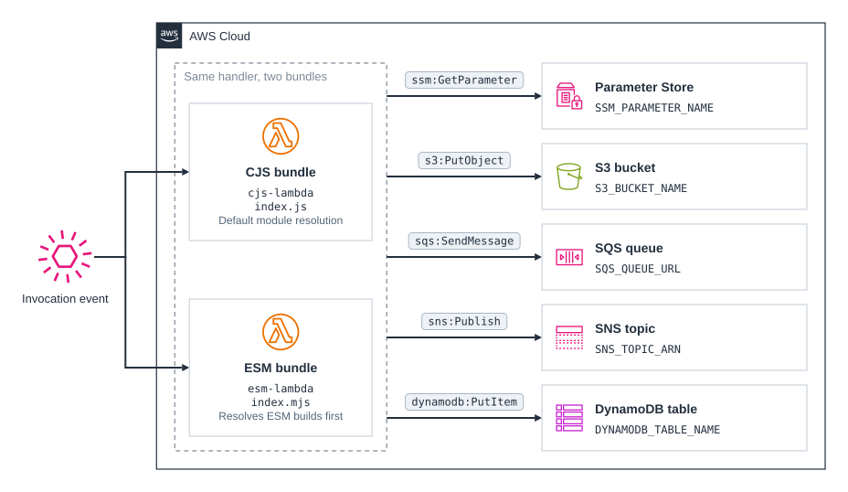

# cdk-lambda-node-esm

CDK app that deploys the same Node.js Lambda handler twice, once bundled the default CommonJS (CJS) way and once as an ES module (ESM) bundle, so you can compare package size and cold start.

## Why ESM bundles are smaller

Most packages ship two builds: a CJS build under `main` and an ESM build under `module`. With `platform=node`, esbuild resolves `main` first, so a default `NodejsFunction` bundles the CJS builds. Those builds are often pre-bundled per package, which leaves esbuild little to tree-shake.

Setting `mainFields: ["module", "main"]` makes esbuild pick the ESM build whenever a package has one and fall back to CJS when it does not. esbuild can then drop every export the handler never reaches. This option alone accounts for the whole size reduction: `format: ESM` without it produces a bundle as large as the CJS one.

The ESM function also sets `format: OutputFormat.ESM`. Once you resolve ESM builds, some of them may use ESM-only syntax such as top-level await, which esbuild cannot convert to CJS output (`Top-level await is currently not supported with the "cjs" output format`). ESM output avoids that.

The CJS function uses the defaults, plus `minify` and `bundleAwsSDK`, which both functions share so that only module resolution differs.

## Results

Measured on 2026-10-08 in `eu-central-1` with `aws-cdk-lib` 2.270.0, esbuild 0.28.2, AWS SDK for JavaScript 3.1138.0, `nodejs24.x`, 1024 MB, and 15 interleaved cold starts per function:

| Function | Bundle | Deployed package | Init duration (median) | First invoke (median) | Cold total (median) | Max memory |
| --- | --- | --- | --- | --- | --- | --- |
| `cjs-lambda` | 1.0 MB | 269 KB | 422 ms | 266 ms | 686 ms | 125 MB |
| `esm-lambda` | 611 KB | 162 KB | 356 ms | 280 ms | 635 ms | 112 MB |

The ESM bundle is 40% smaller and initializes about 66 ms faster. Its first invocation is about 14 ms slower, so the end-to-end cold start gain is about 50 ms (7%).

## When this matters

The gain comes almost entirely from the AWS SDK. `bundleAwsSDK: true` puts the SDK in the bundle, which pins its version instead of relying on the copy in the Lambda runtime. Without it, `NodejsFunction` leaves `@aws-sdk/*` out, and both bundles of this handler shrink to about 29 KB, with no meaningful difference between them.

## Bundling CJS-only dependencies

CJS-only packages still bundle into ESM output: esbuild wraps them, and their `require` calls between bundled modules keep working. The exception is a CJS package that requires a module esbuild leaves out of the bundle, such as a Node.js built-in. That call fails at load time with `Dynamic require of "node:os" is not supported`. If you hit that error, add a banner that defines `require`:

```ts
bundling: {
  format: OutputFormat.ESM,
  mainFields: ["module", "main"],
  banner: "const require = (await import('node:module')).createRequire(import.meta.url);",
},
```

The handler in this project does not need it: its ESM bundle contains no `require` calls.

## Prerequisites

- **_AWS:_**
  - Must have authenticated with [Default Credentials](https://docs.aws.amazon.com/cdk/v2/guide/cli.html#cli_auth) in your local environment.
  - Must have completed the [CDK bootstrapping](https://docs.aws.amazon.com/cdk/v2/guide/bootstrapping.html) for the target AWS environment.
- **_mise:_**
  - [Install mise](https://mise.jdx.dev/installing-mise.html), which manages the required toolchain.

## Installation

```sh
mise install
pnpm install
```

## Deployment

```sh
pnpm run deploy
```

Invoke either function to run the handler against every service:

```sh
aws lambda invoke --function-name esm-lambda /dev/stdout
```

## Cleanup

```sh
pnpm destroy
```

This removes every stack resource, including the bucket and table with their data. Lambda creates the functions' CloudWatch log groups outside the stack, so `/aws/lambda/cjs-lambda`, `/aws/lambda/esm-lambda`, and the bucket auto-delete function's log group remain until you delete them.

## Architecture Diagram


