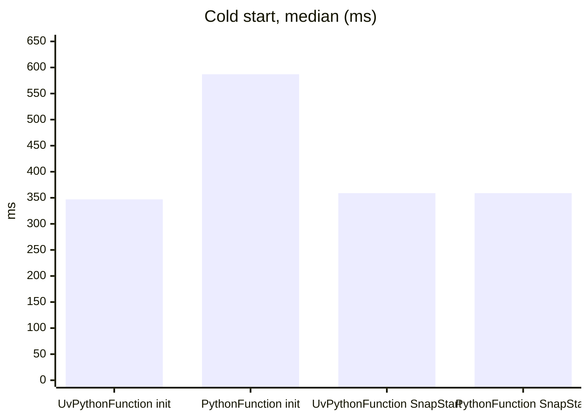
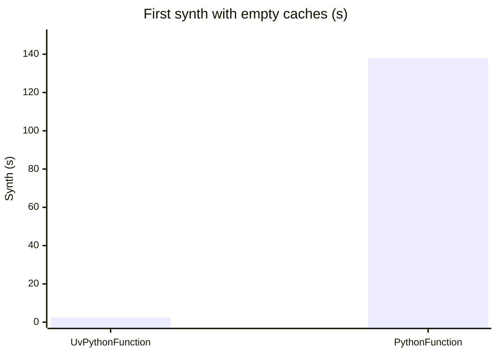

# cdk-lambda-python-uv-enhanced

CDK app that deploys the same Python handler from the same [uv](https://docs.astral.sh/uv/) project twice: with `UvPythonFunction`, a construct in this example that follows uv's [AWS Lambda guide](https://docs.astral.sh/uv/guides/integration/aws-lambda/) and adds what the guide leaves out, and with the official [`PythonFunction`](https://github.com/aws/aws-cdk/tree/main/packages/%40aws-cdk/aws-lambda-python-alpha) from `@aws-cdk/aws-lambda-python-alpha`.

Both functions use the same runtime, architecture, memory, logging and uv version. Each returns a report of how its package was loaded: the interpreter, the CPU, where each module came from, and whether Python could use its shipped bytecode.

## Comparison

Measured in `eu-central-1` on the `python3.15` [preview runtime](https://aws.amazon.com/blogs/compute/introducing-public-preview-runtimes-on-aws-lambda-starting-with-node-js-26-and-python-3-15/) (Python 3.15.0rc2), arm64, 512 MB. Builds ran on an x86_64 host, timing a whole `cdk synth` with only that function in the stack, as the median of three runs.

### Lambda

| | `UvPythonFunction` | Official `PythonFunction` |
| --- | --- | --- |
| Init, median of 30 forced cold starts | 347 ms | 587 ms |
| Init, p90 of 30 forced cold starts | 487 ms | 727 ms |
| First invoke after a cold start, median | 2.7 ms | 2.7 ms |
| Warm invoke, median of 50 | 2.0 ms | 1.8 ms |
| Max memory used | 66 MB | 71 MB |
| Bytecode on Lambda | Precompiled, hash-based, used as shipped | None shipped, so each module is compiled in memory on every cold start |
| Wheels | `aarch64` | `aarch64` |

Once a function is warm, both run the same code at the same speed; the difference is all in loading it.

AWS warns that preview runtimes have slower cold starts than GA runtimes while they are being optimized: on `python3.14`, the same functions initialized in 268 ms and 501 ms.

#### SnapStart

The example leaves [SnapStart](https://docs.aws.amazon.com/lambda/latest/dg/snapstart.html) off. These numbers come from the same functions with it turned on (`snapStart: SnapStartConf.ON_PUBLISHED_VERSIONS`) and invoked through published versions.

| | `UvPythonFunction` | Official `PythonFunction` |
| --- | --- | --- |
| Restore, median | 359 ms | 359 ms |
| Restore, p90 | 400 ms | 400 ms |
| Billed restore, median | 56 ms | 60 ms |
| First invoke after a restore, median | 28 ms | 12 ms |
| Max memory used | 71 MB | 74 MB |

Restores come from three rounds per function: each round published a new version and invoked it 12 times at once, so every invocation landed on a freshly restored execution environment (36 and 35 restores).



SnapStart runs the init phase once, when a version is published, and later cold starts restore that initialized memory. The official construct's modules are compiled during that one init, so its missing bytecode no longer costs anything, and both functions restore in the same time.

For a function this small, though, SnapStart does not beat a package that loads fast on its own: a restore of either function takes about as long as `UvPythonFunction`'s plain init, and the first invocation after a restore is slower than one after a plain init. Lambda bills only part of a restore (56 ms of 359 ms here), but SnapStart adds a charge for caching each published version, for at least three hours, and one for each restore. It pays off when init is expensive, as with the official construct's 587 ms, or for functions that load much more code or data. Lambda has billed the init phase of on-demand functions [since August 2025](https://aws.amazon.com/blogs/compute/aws-lambda-standardizes-billing-for-init-phase/), so a shorter init without SnapStart lowers the bill as well as the latency.

### Package

| | `UvPythonFunction` | Official `PythonFunction` |
| --- | --- | --- |
| Deployed, zipped | 6.7 KB code + 5.8 MB layer | 3.6 MB code |
| Unzipped | 48 KB code + 18 MB layer, bytecode included | 12 MB |
| Upload after a handler-only change | 6.7 KB | 3.6 MB |

### Build

| | `UvPythonFunction` | Official `PythonFunction` |
| --- | --- | --- |
| Needs | uv, with Docker only as a fallback | Docker |
| Bundling image | None | 981 MB, built from the Lambda `python3.15` base image |
| First synth, empty uv cache or no image | 2.5 s | 138 s |
| Synth, caches warm | 1.7 s | 5.2 s |
| Synth after a handler-only change | 1.4 s, the code asset only | 5.1 s, the whole bundle |



The official construct builds its bundling image from the runtime's SAM build image, and there is none for `python3.15` yet. This example gives it [its own](./src/docker/alpha-bundling/Dockerfile) instead: the Lambda base image with what the construct's Dockerfile would add.

## What `UvPythonFunction` does

- **Builds on the host, without Docker.** `uv pip install --python-platform aarch64-manylinux_2_34` installs wheels for Lambda's CPU and Amazon Linux 2023's glibc, whatever the host runs. When uv is missing, the same commands run in the `ghcr.io/astral-sh/uv` image.
- **Splits dependencies from code.** Third-party packages (`uv export --no-emit-local`) go into a layer whose asset hash comes from `uv.lock` and the target alone, so a code change uploads only the project's own few kilobytes and leaves the layer version as it is. The project and any workspace members (`--only-emit-local`) are installed into the function's code.
- **Ships bytecode Lambda can use.** The CDK CLI zips assets with every file's mtime reset to the same fixed date, so timestamp-based `.pyc` files never match their source on Lambda. They are ignored, and the read-only code directories mean Python compiles every module again on each cold start. The construct compiles with `PYC_INVALIDATION_MODE=UNCHECKED_HASH`, which Python trusts without checking the source.
- **Installs only what the lockfile pins.** `uv export --locked` fails when `uv.lock` no longer matches `pyproject.toml`, dependencies install as wheels only (`--no-build`) and with `--require-hashes`, and `--no-installer-metadata` leaves out the files that would differ between builds.

The bytecode mode is what makes the difference in init time without SnapStart. With `UvPythonFunction` on `python3.14` and nothing else changed, the mean init over 10 forced cold starts was 228 ms with hash-based `.pyc` files, 516 ms with none, and 566 ms with timestamp-based ones, which Lambda reports as stale.

The Python project sets `exclude-newer = "3 days"`, uv's [dependency cooldown](https://docs.astral.sh/uv/concepts/resolution/#dependency-cooldowns), to match the workspace's pnpm `minimumReleaseAge`, with a temporary exemption for the first pydantic release that has Python 3.15 wheels. It keeps its package at the project root, because the official construct copies the project directory as-is rather than installing the project.

## Prerequisites

- **_AWS:_**
  - Must have authenticated with [Default Credentials](https://docs.aws.amazon.com/cdk/v2/guide/cli.html#cli-auth) in your local environment.
  - Must have completed the [CDK bootstrapping](https://docs.aws.amazon.com/cdk/v2/guide/bootstrapping.html) for the target AWS environment.
- **_mise:_**
  - [Install mise](https://mise.jdx.dev/installing-mise.html), which manages the required toolchain, including uv.
- **_Docker:_**
  - Must be [installed](https://docs.docker.com/get-docker/) in your system and running at deployment, for the official construct.

## Installation

```sh
mise install
pnpm install
```

## Deployment

```sh
pnpm run deploy
```

Then invoke either function:

```sh
aws lambda invoke --function-name lambda-python-uv-enhanced \
  --cli-binary-format raw-in-base64-out --payload '{"name": "uv"}' response.json
aws lambda invoke --function-name lambda-python-uv-alpha \
  --cli-binary-format raw-in-base64-out --payload '{"name": "uv"}' response.json
```

## Cleanup

```sh
pnpm destroy
```
