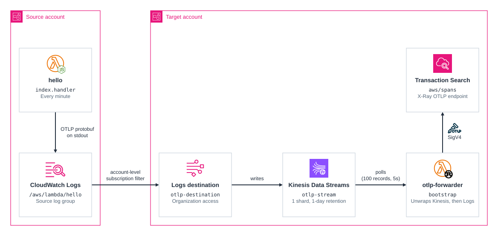
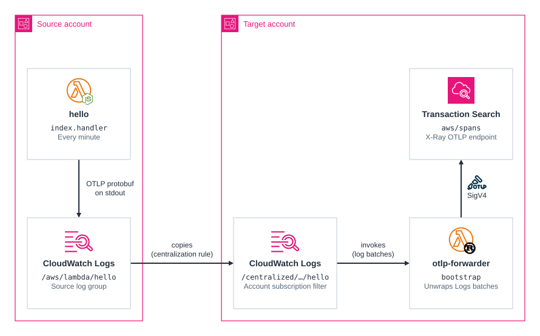
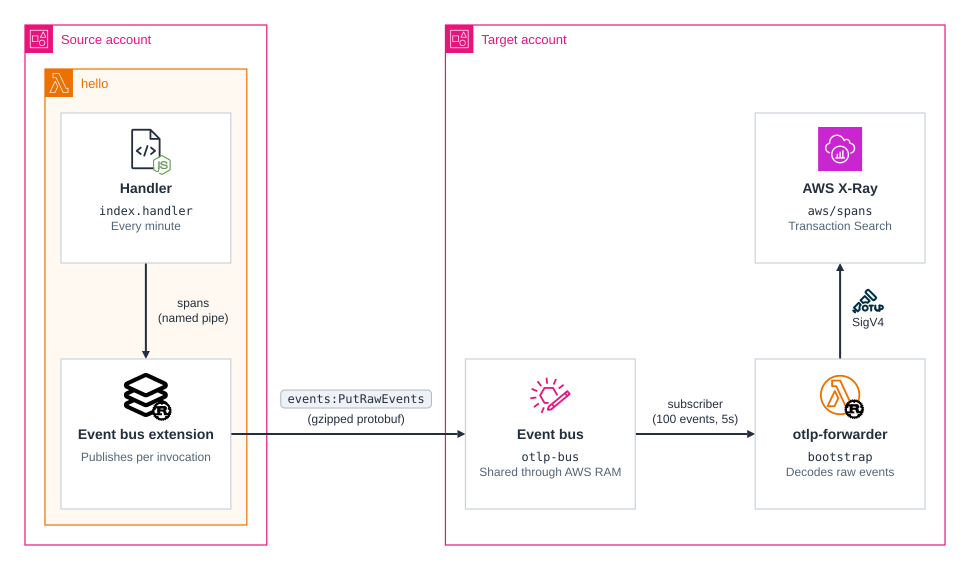

# cdk-serverless-otlp-forwarder-cross-account

CDK app comparing three ways to send OpenTelemetry traces from Lambda functions across an AWS organization to one target account that collects them: a CloudWatch Logs destination, CloudWatch Logs centralization, and a shared EventBridge event bus.

The `hello` function in the source account runs every minute and produces spans, and the `otlp-forwarder` function in the target account sends them to the target account's [CloudWatch OTLP endpoint](https://docs.aws.amazon.com/AmazonCloudWatch/latest/monitoring/CloudWatch-OTLPEndpoint.html), signing each request with SigV4, so they appear in its Transaction Search. The `transport` context value picks how the spans cross between the two accounts:

| Transport | How the spans reach the target account |
| --- | --- |
| `logs-destination` | The function writes its spans to stdout. An account-level subscription filter in the source account sends them to a [CloudWatch Logs destination](https://docs.aws.amazon.com/AmazonCloudWatch/latest/logs/CrossAccountSubscriptions-Kinesis-Account.html) in the target account, which writes them to Kinesis Data Streams. |
| `logs-centralization` | The function writes its spans to stdout. A [centralization rule](https://docs.aws.amazon.com/AmazonCloudWatch/latest/logs/CloudWatchLogs_Centralization.html) copies the source account's Lambda log groups into the target account, where an account-level subscription filter sends them to the forwarder. |
| `event-bus` | The `otlp-stdout-eventbus-extension` layer reads the spans from a pipe and publishes them with `PutRawEvents` to an [enhanced custom event bus](https://docs.aws.amazon.com/eventbridge/latest/userguide/eb-custom-bus-sharing.html) the target account shares through AWS RAM. A subscriber delivers them to the forwarder. |

Each transport wraps the same gzipped OTLP protobuf in its own layers, which the forwarder peels off in order:

| Transport | What the forwarder unwraps |
| --- | --- |
| `logs-destination` | Kinesis record → gzip → CloudWatch Logs batch → log line → base64 → gzip → protobuf |
| `logs-centralization` | `awslogs.data` → base64 → gzip → CloudWatch Logs batch → log line → base64 → gzip → protobuf |
| `event-bus` | event data → base64 → gzip → protobuf |

Each transport admits every account in the organization, so the comparison that matters most at scale is what a new source account has to deploy before its spans arrive:

| Transport | Scoped to the organization by | Each new source account deploys |
| --- | --- | --- |
| `logs-destination` | An `aws:PrincipalOrgID` condition on the destination's access policy | An account-level subscription filter, and the IAM role CloudWatch Logs assumes to check the account's organization |
| `logs-centralization` | The centralization rule's `OrganizationId` scope | Nothing: the rule copies the log groups of every account in the organization |
| `event-bus` | An AWS RAM share with the organization | The extension layer and the bus ARN on every function that sends spans |

The [Comparison](#comparison) section has the measured latency and cost of each transport.

### Related Apps

- [cdk/serverless-otlp-forwarder-cwl](../serverless-otlp-forwarder-cwl) - The single-account version of the two CloudWatch Logs transports: the same stdout spans and account-level subscription filter, with the forwarder in the same account.
- [cdk/serverless-otlp-forwarder-kinesis](../serverless-otlp-forwarder-kinesis) - The single-account counterpart of `event-bus`: its extension publishes the spans to Kinesis Data Streams, and this app's extension is a port of it.

## Prerequisites

- **_AWS:_**
  - Must have completed the steps detailed in the [Configuration](#configuration) section.
  - Must deploy to a Region where the [enhanced custom event bus](https://aws.amazon.com/about-aws/whats-new/2026/09/eventbridge-relaunches-custom-event-buses/) and CloudWatch Logs centralization are available.
  - Must not already have an account-level subscription filter in the source account (`logs-destination`) or the target account (`logs-centralization`), since CloudWatch Logs allows only one per account.
- **_AWS Organizations:_**
  - Both accounts must belong to the same organization.
  - For `logs-centralization`, trusted access for CloudWatch must be turned on, from the management account in the CloudWatch console under **Settings**, **Organization**, which also creates its service-linked role. The target account must then be registered as the CloudWatch delegated administrator, from the management account:

    ```sh
    aws organizations register-delegated-administrator --account-id $CDK_ACCOUNT_TRG --service-principal observabilityadmin.amazonaws.com
    ```

  - For `event-bus`, sharing with AWS Organizations must be enabled in AWS RAM, so that the source account receives the bus without an invitation. From the management account:

    ```sh
    aws ram enable-sharing-with-aws-organization
    ```

- **_CloudWatch:_**
  - Must have enabled [Transaction Search](https://docs.aws.amazon.com/AmazonCloudWatch/latest/monitoring/Enable-TransactionSearch.html) in the target account, so that it accepts spans on its OTLP endpoint.
- **_mise:_**
  - [Install mise](https://mise.jdx.dev/installing-mise.html), which manages the required toolchain.

## Configuration

Set the following variables in your local environment:

- `CDK_ACCOUNT_SRC` - The AWS account ID that runs the sample functions (e.g. `123456789012`)
- `CDK_ACCOUNT_TRG` - The AWS account ID that runs the forwarder (e.g. `123456789012`)
- `CDK_REGION_SHARED` - The AWS region for both accounts (e.g. `eu-central-1`)

After that, complete the [CDK bootstrapping](https://docs.aws.amazon.com/cdk/v2/guide/bootstrapping.html) process for both the `SRC` and `TRG` accounts.

1. Execute the command below with a user having admin privileges in the `SRC` account:

   ```sh
   cdk bootstrap aws://$CDK_ACCOUNT_SRC/$CDK_REGION_SHARED
   ```

2. Execute the command below with a user having admin privileges in the `TRG` account:

   ```sh
   cdk bootstrap aws://$CDK_ACCOUNT_TRG/$CDK_REGION_SHARED --trust $CDK_ACCOUNT_SRC --cloudformation-execution-policies arn:aws:iam::aws:policy/AdministratorAccess
   ```

## Installation

```sh
mise install
pnpm install
```

## Deployment

Execute the command below as admin of the `SRC` account, choosing one transport:

```sh
pnpm run deploy --all -c transport=logs-destination
```

The other values are `logs-centralization` and `event-bus`. The app runs one transport at a time, since two at once would deliver every span to the forwarder twice. To switch, deploy again with the other value, which replaces the previous transport's resources.

> [!WARNING]
> `logs-centralization` is scoped to the whole organization, so its rule copies the Lambda log groups of every account in it into the target account, not only the source account's. In an organization with other workloads, that copies, stores, and subscribes to all of their Lambda logs.

The spans appear in the target account's Transaction Search within a minute. The forwarder's own spans stay in its log group, since the OpenTelemetry SDK exporter it uses for them cannot sign requests.

## Cleanup

Execute the command below as admin of the `SRC` account, with the same context values used to deploy:

```sh
pnpm destroy --all -c transport=logs-destination
```

With `logs-centralization`, CloudWatch Logs creates the centralized log groups in the target account itself, so they remain after the stacks are destroyed. Delete the log groups under `/centralized/` in the target account to remove them.

## Comparison

### Delivery latency

Measured in `eu-central-1` on 2 October 2026, with `hello` running once a minute and each transport deployed for its own 15-minute window. Delivery latency is the forwarder's `DeliveryLatency` metric: the time from the latest span end in a batch to the batch reaching the forwarder. These are figures from one small function over short windows, so treat them as orders of magnitude rather than benchmarks.

Part of each latency is a batching window this app configures, which trades latency for fewer forwarder invocations and can be lowered to zero. The rest is added by the services themselves. At one span batch a minute, a batch never fills before its window ends, so each window adds its full length:

| Transport | Configured batching window | Added by the services, median (range) | Total, median (range) |
| --- | --- | --- | --- |
| `event-bus` | 5s, the subscriber's `MaxBatchWindowInSeconds` | 0.2s (0.1s to 0.3s): the extension's publish and the bus's delivery | 5.2s (5.1s to 5.3s) |
| `logs-destination` | 5s, the Kinesis event source mapping's `maxBatchingWindow` | 5.4s (4.4s to 10.2s): CloudWatch Logs subscription buffering and the write to Kinesis | 10.4s (9.4s to 15.2s) |
| `logs-centralization` | None: a subscription filter that invokes Lambda has no window to set | 21.3s (10.1s to 33.4s): the copy into the target account, then subscription buffering there | 21.3s (10.1s to 33.4s) |

None of the transports lost or duplicated spans: across about four hours of testing, all 240 `hello` invocations reached Transaction Search exactly once.

### Cost

Each `hello` invocation produces about 293 bytes of gzipped OTLP protobuf. On stdout it becomes a 493-byte JSON log line, so the two CloudWatch Logs transports ingest 1.68 times the span bytes; the event bus carries the bytes as they are, but bills each event as at least 1 KB. The extension also publishes inside the invocation, which raised `hello`'s billed duration from 3ms to 62ms. With `eu-central-1` list prices, a month with one million `hello` invocations costs:

| Transport | Data charges | Extension duration | Fixed charges | Total |
| --- | --- | --- | --- | --- |
| `logs-centralization` | \$0.31 of CloudWatch Logs ingestion; the first copy is free | None | None | \$0.31 |
| `event-bus` | \$0.31 of bus ingress and egress | \$0.76 for 57ms at 1,024 MB | None | \$1.07 |
| `logs-destination` | \$0.31 of CloudWatch Logs ingestion | None | \$13.14 for the Kinesis shard | \$13.45 |

The data charges scale with the bytes of spans, and the extension's duration with the number of invocations. For small spans like these, the extension's duration outweighs what the bus saves. Once invocations emit 1 KB of spans or more, so that the bus's 1 KB minimum no longer applies, the data charges come to about \$0.31 per GB of spans for `event-bus` against about \$1.06 for the two CloudWatch Logs transports, plus storage for the copy with `logs-centralization`. That saving covers the extension's duration from roughly 1 to 1.5 KB of gzipped spans per invocation at 1,024 MB, and a smaller function memory lowers the extension's share proportionally. Costs that every transport shares, such as span ingestion into Transaction Search, both functions' invocations, and log storage in the source account, are left out.

### Pricing

The list prices used, all in `eu-central-1`:

| Service | Item | Price |
| --- | --- | --- |
| CloudWatch Logs | Standard log class ingestion | \$0.63 per GB |
| CloudWatch Logs | Centralized copies after the first | \$0.05 per GB |
| CloudWatch Logs | Log storage | \$0.0324 per GB-month |
| Kinesis Data Streams | Provisioned shard | \$0.018 per shard-hour |
| Kinesis Data Streams | PUT payload units of 25 KB | \$0.0175 per million |
| EventBridge enhanced custom event bus | Ingress, first 5,000 GB | \$0.2351 per GB |
| EventBridge enhanced custom event bus | Egress, per subscriber | \$0.0711 per GB |
| Lambda | Duration on Arm | \$0.0000133334 per GB-second |

## Transport Diagrams

### `logs-destination`



### `logs-centralization`



### `event-bus`


