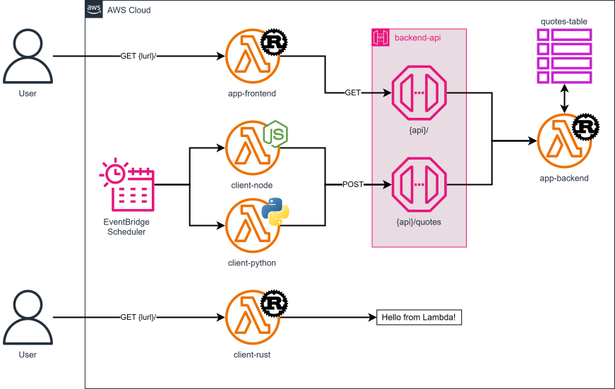
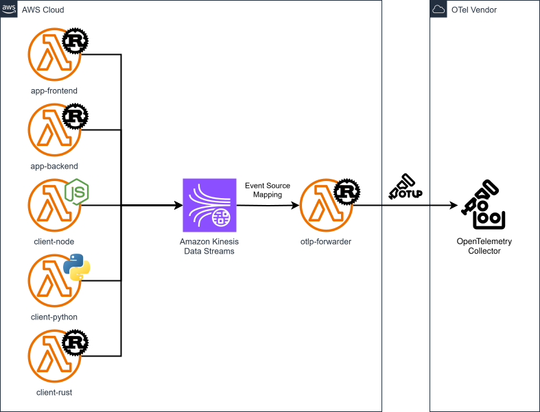

# cdk-serverless-otlp-forwarder-kinesis

CDK app showcasing a serverless approach to send OpenTelemetry traces to any OTel-compatible vendor using Kinesis Data Streams and Lambda.

### Related Apps

- [cdk/serverless-otlp-forwarder-cwl](../../cdk/serverless-otlp-forwarder-cwl) - Uses CloudWatch Logs as OTLP transport layer instead of Kinesis Data Streams.

- [cdk/serverless-otlp-ch-forwarder-kinesis](../../cdk/serverless-otlp-ch-forwarder-kinesis) - Sends traces to ClickHouse instead of an OTel-compatible vendor.

- [cdk/serverless-otlp-ch-forwarder-cwl](../../cdk/serverless-otlp-ch-forwarder-cwl) - Sends traces to ClickHouse instead of an OTel-compatible vendor; uses CloudWatch Logs as OTLP transport layer instead of Kinesis Data Streams.

## Prerequisites

- **_AWS:_**
  - Must have authenticated with [Default Credentials](https://docs.aws.amazon.com/cdk/v2/guide/cli.html#cli_auth) in your local environment.
  - Must have completed the [CDK bootstrapping](https://docs.aws.amazon.com/cdk/v2/guide/bootstrapping.html) for the target AWS environment.
- **_OTel Vendor:_**
  - Must have set the `OTEL_EXPORTER_OTLP_ENDPOINT` and `OTEL_EXPORTER_OTLP_HEADERS` variables in your local environment.
- **_mise:_**
  - [Install mise](https://mise.jdx.dev/installing-mise.html), which manages the required toolchain.
- **_Docker:_**
  - Must be [installed](https://docs.docker.com/get-docker/) in your system and running at deployment.

## Installation

```sh
mise install
pnpm install
```

## Deployment

```sh
pnpm run deploy
```

## Cleanup

```sh
pnpm destroy
```

## Architecture Diagram



## Observability Diagram


