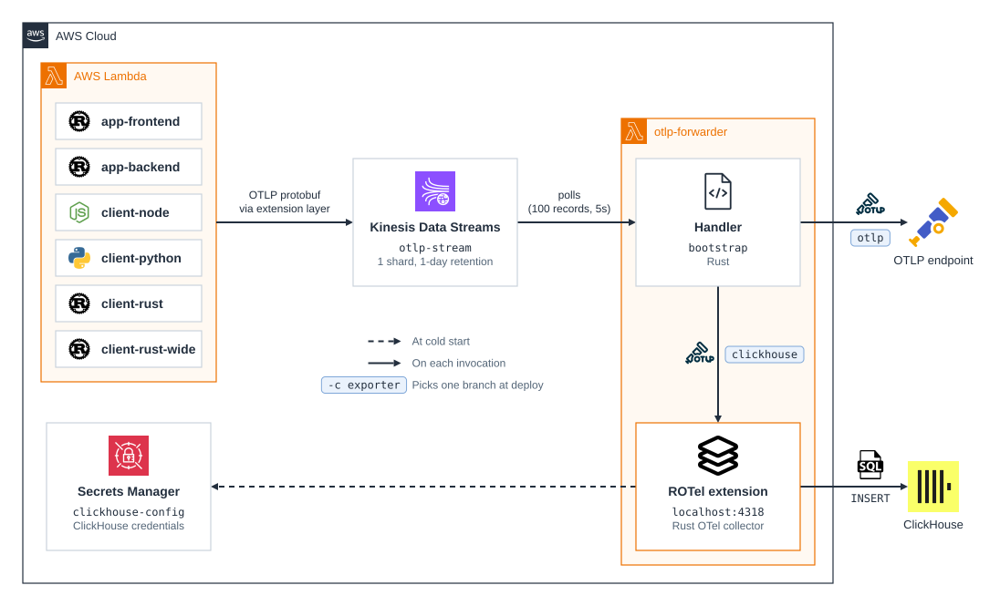
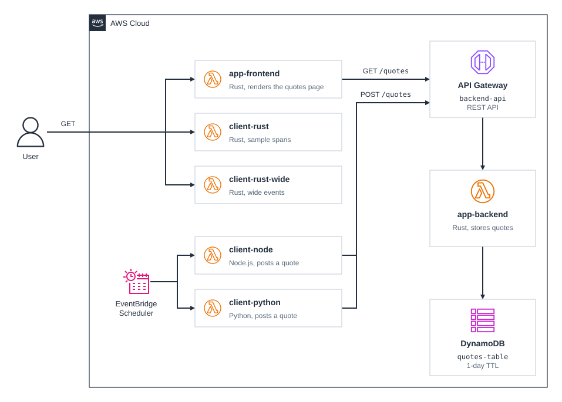

# cdk-serverless-otlp-forwarder-kinesis

CDK app showcasing a serverless approach to send OpenTelemetry traces from Lambda functions to an OTLP endpoint, to ClickHouse, or to CloudWatch, using Kinesis Data Streams and Lambda.

Every sample function carries the `otlp-stdout-kinesis-extension` layer, which puts the spans the function exports into the `otlp-stream` Kinesis data stream. The `otlp-forwarder` function reads the stream through an event source mapping and sends the spans to the OTLP endpoint in your environment or, through the [ROTel Lambda extension](https://github.com/rotel-dev/rotel-lambda-extension), to ClickHouse, or, signing each request with SigV4, to the account's [CloudWatch OTLP endpoint](https://docs.aws.amazon.com/AmazonCloudWatch/latest/monitoring/CloudWatch-OTLPEndpoint.html).

### Related Apps

- [cdk/serverless-otlp-forwarder-cwl](../serverless-otlp-forwarder-cwl) - Uses CloudWatch Logs as OTLP transport layer instead of Kinesis Data Streams.
- [cdk/serverless-otlp-forwarder-cross-account](../serverless-otlp-forwarder-cross-account) - Uses a forwarder in another account instead of the same account, comparing three cross-account transports.

## Prerequisites

- **_AWS:_**
  - Must have authenticated with [Default Credentials](https://docs.aws.amazon.com/cdk/v2/guide/cli.html#cli_auth) in your local environment.
  - Must have completed the [CDK bootstrapping](https://docs.aws.amazon.com/cdk/v2/guide/bootstrapping.html) for the target AWS environment.
- **_OTLP exporter (default):_**
  - Must have set the `OTEL_EXPORTER_OTLP_ENDPOINT` and `OTEL_EXPORTER_OTLP_HEADERS` variables in your local environment.
- **_ClickHouse exporter:_**
  - Must have set the `CLICKHOUSE_ENDPOINT`, `CLICKHOUSE_DATABASE`, `CLICKHOUSE_USERNAME` and `CLICKHOUSE_PASSWORD` variables in your local environment.
  - Must have created the OpenTelemetry tables in that database, for example with [clickhouse-ddl](https://github.com/rotel-dev/rotel/tree/main/src/bin/clickhouse-ddl):

    ```sh
    docker run --rm streamfold/rotel-clickhouse-ddl create --endpoint "$CLICKHOUSE_ENDPOINT" \
      --database "$CLICKHOUSE_DATABASE" --user "$CLICKHOUSE_USERNAME" --password "$CLICKHOUSE_PASSWORD" \
      --traces --logs
    ```

  - Must deploy to a Region where the [ROTel extension layer](https://github.com/rotel-dev/rotel-lambda-extension/releases) is published.
- **_CloudWatch exporter:_**
  - Must have enabled [Transaction Search](https://docs.aws.amazon.com/AmazonCloudWatch/latest/monitoring/Enable-TransactionSearch.html) in the target account, so that it accepts spans on its OTLP endpoint.
- **_mise:_**
  - [Install mise](https://mise.jdx.dev/installing-mise.html), which manages the required toolchain.
- **_Docker:_**
  - Must be [installed](https://docs.docker.com/get-docker/) in your system and running at deployment.

## Installation

```sh
mise install
pnpm install
```

## Deployment

```sh
pnpm run deploy
```

The forwarder sends the traces to the OTLP endpoint by default. To send them to ClickHouse or CloudWatch instead, pass the `exporter` context value:

```sh
pnpm run deploy -c exporter=clickhouse
pnpm run deploy -c exporter=cloudwatch
```

With ClickHouse, the ROTel extension also exports the forwarder's own logs, and reads the ClickHouse credentials from the `clickhouse-config` secret when the forwarder starts. With CloudWatch, the spans appear in the account's Transaction Search, and the forwarder writes its own spans to its log group, since the OpenTelemetry SDK exporter it uses for them cannot sign requests.

## Cleanup

```sh
pnpm destroy
```

The app checks the chosen exporter's variables whenever it runs, so pass the same value to remove a ClickHouse deployment:

```sh
pnpm destroy -c exporter=clickhouse
```

## Telemetry Pipeline Diagram



## Sample Application Diagram


