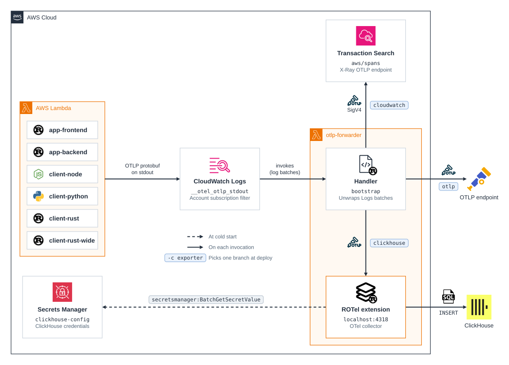
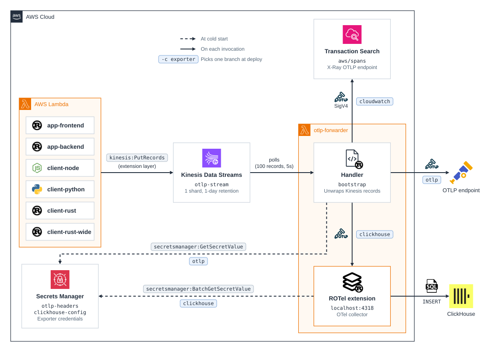
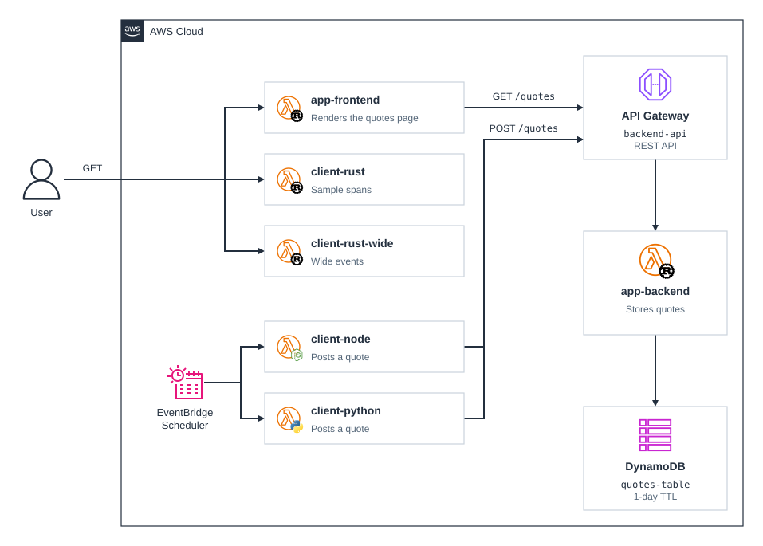

# cdk-serverless-otlp-forwarder-single-account

CDK app showcasing a serverless approach to send OpenTelemetry traces from Lambda functions to CloudWatch, to an OTLP endpoint, or to ClickHouse, using CloudWatch Logs or Kinesis Data Streams and Lambda.

The sample functions export their spans as gzipped OTLP protobuf in JSON lines, and the `otlp-forwarder` function sends them, signing each request with SigV4, to the account's [CloudWatch OTLP endpoint](https://docs.aws.amazon.com/AmazonCloudWatch/latest/monitoring/CloudWatch-OTLPEndpoint.html), to the OTLP endpoint in your environment, or, through the [ROTel Lambda extension](https://github.com/rotel-dev/rotel-lambda-extension), to ClickHouse. The `transport` context value picks how the spans reach the forwarder, as described in [Transports](#transports).

### Related Apps

- [cdk/serverless-otlp-forwarder-cross-account](../serverless-otlp-forwarder-cross-account) - Uses a forwarder in another account instead of the same account, comparing three cross-account transports.

## Prerequisites

- **_AWS:_**
  - Must have authenticated with [Default Credentials](https://docs.aws.amazon.com/cdk/v2/guide/cli.html#cli_auth) in your local environment.
  - Must have completed the [CDK bootstrapping](https://docs.aws.amazon.com/cdk/v2/guide/bootstrapping.html) for the target AWS environment.
  - For `logs-subscription`, must not already have an account-level subscription filter in the target account, since CloudWatch Logs allows only one.
- **_CloudWatch exporter (default):_**
  - Must have enabled [Transaction Search](https://docs.aws.amazon.com/AmazonCloudWatch/latest/monitoring/Enable-TransactionSearch.html) in the target account, so that it accepts spans on its OTLP endpoint.
- **_OTLP exporter:_**
  - Must have set the `OTEL_EXPORTER_OTLP_ENDPOINT` and `OTEL_EXPORTER_OTLP_HEADERS` variables in your local environment.
- **_ClickHouse exporter:_**
  - Must have set the `CLICKHOUSE_ENDPOINT`, `CLICKHOUSE_DATABASE`, `CLICKHOUSE_USERNAME` and `CLICKHOUSE_PASSWORD` variables in your local environment.
  - Must have created the OpenTelemetry tables in that database, for example with [clickhouse-ddl](https://github.com/rotel-dev/rotel/tree/main/src/bin/clickhouse-ddl):

    ```sh
    docker run --rm streamfold/rotel-clickhouse-ddl create --endpoint "$CLICKHOUSE_ENDPOINT" \
      --database "$CLICKHOUSE_DATABASE" --user "$CLICKHOUSE_USERNAME" --password "$CLICKHOUSE_PASSWORD" \
      --traces --logs
    ```

  - Must deploy to a Region where the [ROTel extension layer](https://github.com/rotel-dev/rotel-lambda-extension/releases) is published.
- **_mise:_**
  - [Install mise](https://mise.jdx.dev/installing-mise.html), which manages the required toolchain.
- **_Docker:_**
  - Must be [installed](https://docs.docker.com/get-docker/) in your system and running at deployment.

## Installation

```sh
mise install
pnpm install
```

## Deployment

```sh
pnpm run deploy
```

To send the spans through Kinesis Data Streams instead of the CloudWatch Logs subscription, pass the `transport` context value:

```sh
pnpm run deploy -c transport=kinesis
```

The forwarder sends the traces to the account's CloudWatch OTLP endpoint by default, where they appear in Transaction Search. To send them to an OTLP endpoint in your environment or to ClickHouse instead, pass the `exporter` context value:

```sh
pnpm run deploy -c exporter=otlp
pnpm run deploy -c exporter=clickhouse
```

With ClickHouse, the ROTel extension also exports the forwarder's own logs, and reads the ClickHouse credentials from the `clickhouse-config` secret when the forwarder starts. With CloudWatch, the forwarder writes its own spans to its log group, since the OpenTelemetry SDK exporter it uses for them cannot sign requests.

## Cleanup

```sh
pnpm destroy
```

The app checks the chosen exporter's variables whenever it runs, so pass the same value to remove a ClickHouse deployment:

```sh
pnpm destroy -c exporter=clickhouse
```

## Transports

Between them, the single-account and cross-account apps cover five transports:

| App | Transport | What carries the spans |
| --- | --- | --- |
| single-account | `logs-subscription` | subscription filter → forwarder, same account |
| single-account | `kinesis` | Lambda extension → Kinesis → forwarder |
| cross-account | `logs-destination` | subscription filter → destination → Kinesis in the target account |
| cross-account | `logs-centralization` | centralization copy → subscription filter in the target account |
| cross-account | `event-bus` | Lambda extension → shared Custom Event Bus → forwarder |

Each transport wraps the same gzipped OTLP protobuf in its own layers, which the forwarder peels off in order.

### `logs-subscription`

The default. The functions write their spans to stdout, and an account-level CloudWatch Logs subscription filter delivers those log lines to the forwarder.



The forwarder unwraps `awslogs.data` → base64 → gzip → CloudWatch Logs batch → log line → base64 → gzip → protobuf.

### `kinesis`

Every function except the forwarder carries the `otlp-stdout-kinesis-extension` layer, which reads the spans from a pipe and puts them, together with spans it builds from the Lambda platform's telemetry such as `Lambda/Init`, into the `otlp-stream` Kinesis data stream. The forwarder reads the stream through an event source mapping.



The forwarder unwraps Kinesis record → JSON line → base64 → gzip → protobuf.

## Sample Application

Every function exports its spans the same way, so each one shows a different side of the instrumentation instead:

- `app-frontend`: a Function URL that renders an HTML page of recent quotes, which it reads from `app-backend` through API Gateway, so its traces span both functions and DynamoDB.
- `app-backend`: the API Gateway backend that stores and reads the quotes in DynamoDB, with a span for each DynamoDB call.
- `client-node`: runs every 5 minutes, fetches a random quote and posts it to `app-backend`. The OpenTelemetry undici instrumentation traces its `fetch` calls and sends the trace context, so the backend's spans join its trace.
- `client-python`: does the same as `client-node`, with its steps as decorated spans and its HTTP calls traced by the OpenTelemetry `requests` instrumentation.
- `client-rust`: a Function URL that records span events and, on `/error`, randomly fails with an expected or unexpected error, to show span status.
- `client-rust-wide`: a Function URL that copies the attributes of every span in a trace onto its root span before export, since the forwarder has no collector to do that.


