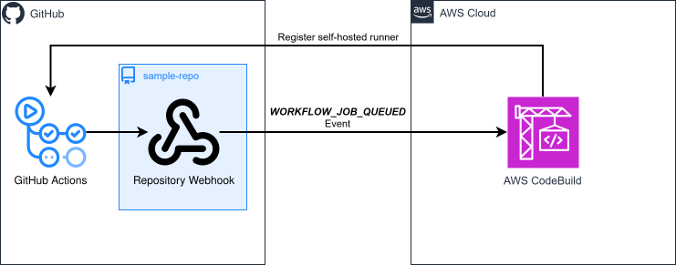

# cdktn-codebuild-gha-runners

CDKTN app that deploys a GitHub repository in a personal account, along with a repository webhook that triggers [CodeBuild-hosted GitHub Actions runners](https://docs.aws.amazon.com/codebuild/latest/userguide/action-runner.html) when workflow jobs are queued.

### Related Apps

- [cdktn/codebuild-gha-runners-org](../../cdktn/codebuild-gha-runners-org) - Uses a GitHub organization webhook instead of repository webhook.
- [cdk/codebuild-gha-runners](../../cdk/codebuild-gha-runners) - Built with AWS CDK instead of CDKTF.

## Prerequisites

- **_AWS:_**
  - Must have authenticated with [Default Credentials](https://registry.terraform.io/providers/hashicorp/aws/latest/docs#authentication-and-configuration) in your local environment.
- **_GitHub:_**
  - Must have set the `GITHUB_TOKEN` variable in your local environment, with the `repo` and `workflow` scopes.
- **_mise:_**
  - [Install mise](https://mise.jdx.dev/installing-mise.html), which manages Node, pnpm, and OpenTofu.

## Installation

```sh
mise install
pnpm install
pnpm gen
```

`pnpm gen` generates the AWS and GitHub provider constructs into `.gen/`. Re-run it whenever a provider constraint in `cdktf.json` changes.

## Deployment

```sh
pnpm run deploy
```

## Usage

1. Access the GitHub Actions workflow by clicking the `<GHA_WORKFLOW_URL>` from the deployment outputs:

   ```sh
   Outputs:
   GhaWorkflowUrl = <GHA_WORKFLOW_URL>
   ```

2. Click `Run workflow` ➜ `Run workflow`.

3. Your workflow will be enqueued and run on an ephemeral EC2 instance managed by AWS CodeBuild.

## Cleanup

```sh
pnpm destroy
```

## Architecture Diagram


