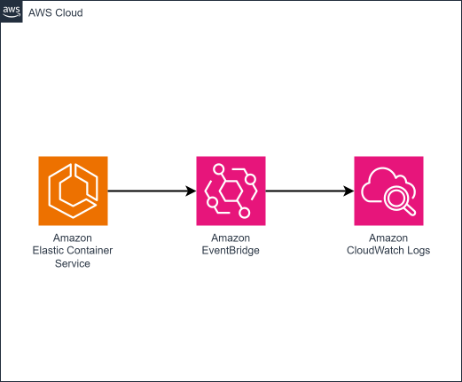

# cdktn-ecs-task-events-logger

CDKTN app that captures all [ECS Task events](https://docs.aws.amazon.com/AmazonECS/latest/developerguide/ecs_task_events.html) that contain errored tasks and stores them in CloudWatch Logs.

### Related Apps

- [cdktn/ecs-task-events-tagger](../../cdktn/ecs-task-events-tagger) - Sends ECS Task events to a Lambda function for tagging before storing in CloudWatch Logs.

## Prerequisites

- **_AWS:_**
  - Must have authenticated with [Default Credentials](https://registry.terraform.io/providers/hashicorp/aws/latest/docs#authentication-and-configuration) in your local environment.
- **_mise:_**
  - [Install mise](https://mise.jdx.dev/installing-mise.html), which manages Node, pnpm, and OpenTofu.

## Installation

```sh
mise install
pnpm install
pnpm gen
```

`pnpm gen` generates the AWS provider constructs into `.gen/`. Re-run it whenever the provider constraint in `cdktf.json` changes.

## Deployment

```sh
pnpm run deploy
```

## Cleanup

```sh
pnpm destroy
```

## Architecture Diagram


