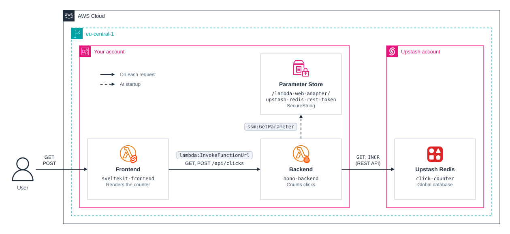

# cdktn-lambda-web-adapter

CDKTN app that runs a SvelteKit frontend and a Hono backend as Lambdaliths on AWS Lambda through the Lambda Web Adapter, with an Upstash Redis database for state.

Each app is an ordinary Node web server in an arm64 container image. The [AWS Lambda Web Adapter](https://github.com/awslabs/aws-lambda-web-adapter) runs as a Lambda extension inside the image, turns each invocation into an HTTP request to the server, and each function is exposed over a Lambda function URL.

## Prerequisites

- **_AWS:_**
  - Must have authenticated with [Default Credentials](https://registry.terraform.io/providers/hashicorp/aws/latest/docs#authentication-and-configuration) in your local environment.
- **_Upstash:_**
  - Must have set the `UPSTASH_EMAIL` and `UPSTASH_API_KEY` variables in your local environment.
- **_mise:_**
  - [Install mise](https://mise.jdx.dev/installing-mise.html), which manages Node, pnpm, and OpenTofu.
- **_Docker:_**
  - Must be [installed](https://docs.docker.com/get-docker/) in your system and running at deployment.

## Installation

```sh
mise install
pnpm install
pnpm gen
```

`pnpm gen` generates the AWS, Docker, and Upstash provider constructs into `.gen/`. Re-run it whenever a provider constraint in `cdktf.json` changes.

The Hono backend in `src/functions/backend` and the SvelteKit frontend in `src/functions/frontend` are standalone pnpm projects with their own lockfiles, because each one is the build context of its Docker image. Biome lints them with the rest of the app, and `pnpm check` installs and typechecks them.

## Deployment

```sh
pnpm run deploy
```

Each image is rebuilt and pushed only when a file in its build context changes.

## Cleanup

```sh
pnpm destroy
```

## Application Details

Each function shares its name with the ECR repository that holds its image.

- `hono-backend`
  - Environment variables:
    - `UPSTASH_REDIS_REST_URL` and `UPSTASH_REDIS_REST_TOKEN` - REST endpoint and token of the `click-counter` database, read by `Redis.fromEnv()` from `@upstash/redis`
  - Endpoints:
    - `GET /` - Hello message
    - `GET /ping` - Returns `pong`; the Lambda Web Adapter's readiness check
    - `GET /api/clicks` - Returns the current click count
    - `POST /api/clicks` - Increments the click count and returns it
    - Both `/api/clicks` routes report the Redis call's duration in a `Server-Timing: redis;dur=…` header, which the frontend uses to time each hop
- `sveltekit-frontend`
  - Environment variables:
    - `BACKEND_URL` - Function URL of `hono-backend`, declared and validated in `src/env.ts`
  - Endpoints:
    - `GET /` - Click counter, rendered on the server, with the time of each hop on the last request
    - `POST /` - Form action that increments the counter through the backend; it is the page's default action, because function URLs reject the `/` in a named action's `?/name` query string
    - `GET /ping` - Returns `pong`; the Lambda Web Adapter's readiness check

Both servers listen on port 3000, which the images pass to the adapter as `AWS_LWA_PORT`.

## Architecture Diagram



Upstash runs the database in its own AWS account in the same Region; the backend reaches it over HTTPS through Upstash's REST API, not through your account's network.
